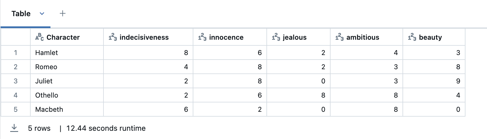
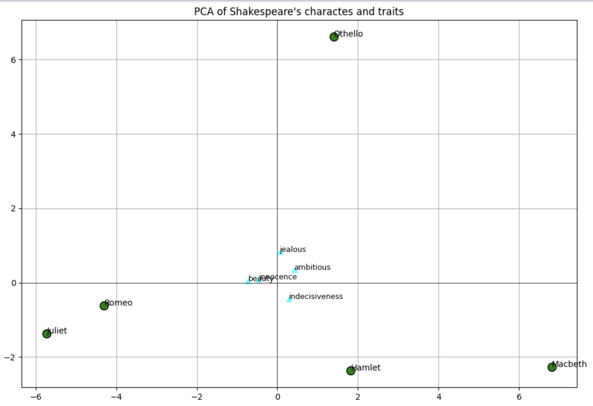

## chaining LLM with PCA to visualize the Shakespeare text's characters and traits through correspondence analysis.
### Taught process:

## steps:
1- **choose a dataset:** Shakespeare: I take a look at data and investigate the text 

2- **preprocess and clean:** remove extra characters like escape chars 
    - there are *** that separate header and footers, so I use this indicator to throw away unncessary text
    -  removed extra spaces
    
3- **LLM request: NER:** assign score to each trait of that character
    
    
4- **LLM request: NER:** assign score to each trait of that character
    - I run the for loop to have an API call and get response and investigate it.
    - After each investigation I add some more instructions to teh prompt and modify it. to get better result.
    - I printed response methods step by step until I end up with response.json['choices'][0]['message']['content']
    - converted str to dict
    
    
5- **PCA:** create a plot of principle component analysis using the 2 top components (on a 2-d plane)
    - I played around with the traits and add and remove to see how it works.

I use a function to get the corpus and extract relevant sections to a character. For example outputs the text related to Hamlet. 
Next I'll use the output of this function as an input to the LLM. So in LLM, I want the agent to get the relevant info of a character and considering a list of traits it outputs a score for each of the traits. for examle like this:  

**Output of LLM**  

["indecisiveness":10, "ambitious":7, "innocence":1, "jealous":1, "beauty": 0]

Then I feed these characters together with their corresponding trait score into a PCA to map them all into a Cartesian plane and compare and analyze

Why I choose 4 characters: I searched to find the top famous characters in the Shakespeare text. For simplicity I keep it as 4 characters.

Here is the final visualization:
As you can see by mapping multiple traits and characters all in the same plane we can vsually judge which trait is closer to a character.
We also can compare the characters and see how close to each other they are. 
For example:
- **Hamlet** is close to **indecisiveness** this makes sense because his most famous term is *"To be, or not to be—that is the question."*
- **Romeo** and **Juliet** are close to each other in comparison with other characters.
- The closest trait to **Juliet** is **beauty**.
- The two traits **jealous** and **ambitious** are close to each other
- etc.

